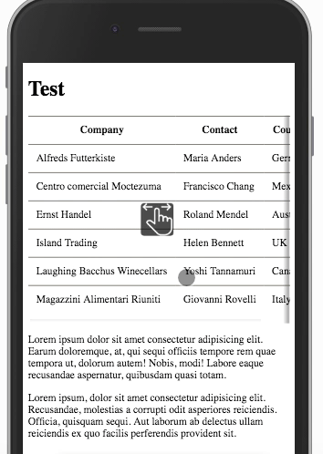

# ScrollHint

Suggests that the elements are scrollable horizontally, with the `pointer icon`.



## Installation

### via npm

```sh
npm install scroll-hint --save
```

### via yarn

```sh
yarn add scroll-hint
```

### via cdn

```html
<link rel="stylesheet" href="https://unpkg.com/scroll-hint@1.1.2/css/scroll-hint.css">
<script src="https://unpkg.com/scroll-hint@1.1.2/js/scroll-hint.js"></script>
```


## Usage

import the js with babel and Browserify/Webpack

```js
import ScrollHint from 'scroll-hint';
new ScrollHint('.js-scrollable');
```

## Option

<table class="table-">
  <tr>
    <th style="text-align:left;">Name</th>
    <th style="text-align:left;">Default</th>
    <th style="text-align:left;">Description</th>
  </tr>
  <tr>
    <td><code>suggestClass</code></td>
    <td>is-active</td>
    <td>Classname to be added when the element is scrolled-in</td>
  </tr>
  <tr>
    <td><code>scrollableClass</code></td>
    <td>is-scrollable</td>
    <td>Classname to be added when the element is scrollable</td>
  </tr>
  <tr>
    <td><code>scrollableRightClass</code></td>
    <td>is-right-scrollable</td>
    <td>Classname to be added when the element is right-scrollable</td>
  </tr>
  <tr>
    <td><code>scrollableLeftClass</code></td>
    <td>is-left-scrollable</td>
    <td>Classname to be added when the element is left-scrollable</td>
  </tr>
  <tr>
    <td><code>scrollHintClass</code></td>
    <td>scroll-hint</td>
    <td>Classname to be added to the element</td>
  </tr>
  <tr>
    <td><code>scrollHintIconClass</code></td>
    <td>scroll-hint-icon</td>
    <td>Classname to be added to the icon</td>
  </tr>
  <tr>
    <td><code>scrollHintIconAppendClass</code></td>
    <td>scroll-hint-icon-white</td>
    <td>Another classname to be added to the element's icon</td>
  </tr>
  <tr>
    <td><code>scrollHintIconWrapClass</code></td>
    <td>scroll-hint-icon-wrap</td>
    <td>Classname to be added to the icon's wrapper</td>
  </tr>
  <tr>
    <td><code>scrollHintText</code></td>
    <td>scroll-hint-text</td>
    <td>Classname to be added to the text</td>
  </tr>
  <tr>
    <td><code>remainingTime</code></td>
    <td>-1</td>
    <td>When to hide scroll-hint icon (ms)</td>
  </tr>
  <tr>
    <td><code>scrollHintBorderWidth</code></td>
    <td>10</td>
    <td>Shadowbox border width of the element</td>
  </tr>
  <tr>
    <td><code>enableOverflowScrolling</code></td>
    <td>true</td>
    <td>When using iOS and the value is true,<br>
          -webkit-overflow-scrolling property will be added to the element</td>
  </tr>
  <tr>
    <td><code>suggestiveShadow</code></td>
    <td>false</td>
    <td>Show suggestive shadow, when the element is scrollable</td>
  </tr>
  <tr>
    <td><code>applyToParents</code></td>
    <td>false</td>
    <td>Apply JavaScript to the parent element</td>
  </tr>
  <tr>
    <td><code>offset</code></td>
    <td>0</td>
    <td>You can change criteria for scrollable.</td>
  </tr>
  <tr>
    <td><code>i18n.scrollable</code></td>
    <td>scrollable</td>
    <td>You can change the scrollable text from here</td>
  </tr>
</table>

